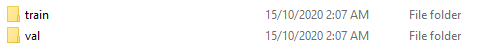
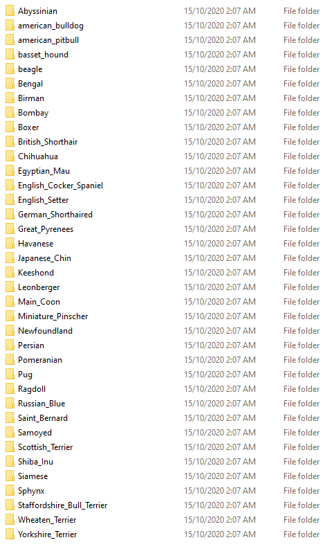
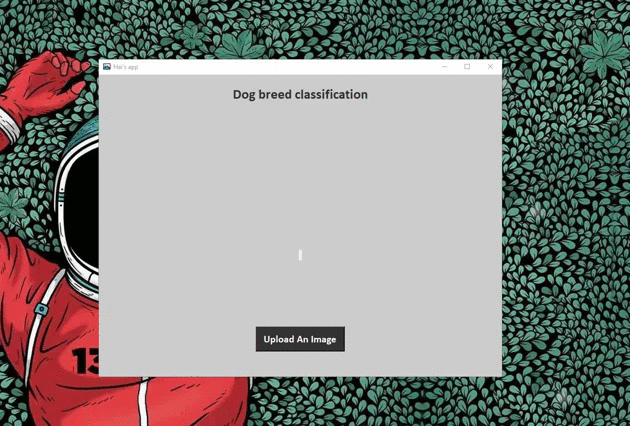

# Ứng Dụng Phân Loại Các Giống Chó, Mèo


<!--more-->

## BÀI TOÁN PHÂN LỚP TRONG MACHINE LEARNING - ỨNG DỤNG NHẬN DIỆN CÁC GIỐNG CHÓ, MÈO
Bài  toán  phân  lớp (classification) là  một  trong  những  bài  toán  lớn  trong  lĩnh  vực Machine Learnig (ML). Classification  là  quá  trình  phân  lớp  một  đối  tượng  dữ  liệu  vào  một hay nhiều  lớp  đã  cho  trước  nhờ  một  mô  hình  phân  lớp (classification model). Mô  hình  này  được  xây  dựng  dựa  trên  một  tập  dữ  liệu  được  xây  dựng  trước  đó (hay còn  gọi  là  tập  huấn  luyện). Quá  trình  phân  lớp  là  quá  trình  gán  nhãn  cho  đối  tượng  dữ  liệu.

Có  nhiều  bài  toán  phân  lớp  dữ  liệu  như  phân  lớp  nhị  phân (binary), phân  lớp  đa  lớp (multiclass),...:

 - **Bài  toán  phân  lớp  nhị  phân**  là  bài  toán  gắn  nhãn  dữ  liệu  cho  đối  tượng  vào  một  trong  hai  lớp  khác  nhau  dựa  vào  việc  dữ  liệu  dó  có hay không  các  đặc  trưng (feature) của  bộ  phân  lớp.
 - **Bài  toán  phân  lớp  đa  lớp**  là  quá  trình  phân  lớp  dữ  liệu  với  số  lượng  lớp  lớn  hơn  hai. Như  vậy  với  từng  dữ  liệu  chúng ta phải  xem  xét  và  phân  lớp  chúng  vào  những  lớp  khác  nhau  chứ  không  phải  là  hai  lớp  như  bài  toán  phân  lớp  nhị  phân. Và  thực  chất  bài  toán  phân  lớp  nhị  phân  là  một  bài  toán  đặt  biệt  của  phân  lớp  đa  lớp.

Ứng  dụng  của  bài  toán  này  được  sử  dụng  rất  nhiều  và  rộng  rãi  trong  thực  tế  ví  dụ  như  bài  toán  nhận  dạng  khuôn  mặt, nhận  diện  giọng  nói, phát  hiện email spam…

Và  đối  với  các  bài  toán  phân  lớp  dữ  liệu  chúng ta sử  dụng  các  thuật  toán  học  có  giám  sát (supervised learning) để  xây  dựng  mô  hình  cho  bài  toán  này.

Sau đây mình sẽ hướng dẫn các bạn cách xây dựng một project *"Nhận diện, phân loại các giống chó mèo"* từ A-Z sử dụng bộ dữ liệu thực tế.
Bài toán mình giới thiệu ở đây thuộc dạng phân lớp đa lớp (multi classification) sử dụng Farmework pytorch, ngôn ngữ python và tkinter để tạo giao diện cho ứng dụng. 
Okay, bắt đầu thôi nhỉ :D
### 1.  Chuẩn bị tập dữ liệu huấn luyện
Bộ  dữ  liệu  mình  sử  dụng  để  phân  loại  giống  chó, mèo các bạn có thể tải về tại đây :
[Pets Dataset](http://www.robots.ox.ac.uk/~vgg/data/pets/?fbclid=IwAR2BOAKYc3FE24S5Um9xXwK-qan3OFjutcmE0gm8dP4zBtZqwxpQzIA-yaI)

>Tập dữ liệu gồm 37 loại vật nuôi và khoảng 200 ảnh cho mỗi loại.

Sau khi tải dataset về ta tạo một folder data chia lại các thư mục như sau: 
 

Trong thư mục train và val, sẽ chứa các thư mục con có tên các loài và ảnh của chúng:
 
Mình chia tập  dữ  liệu  thành 2 phần : training và validation để  phục  vụ  cho  mục  đích training và  kiểm  tra  độ  chính  xác. 
Đầu tiên, khai báo các thư viện sử dụng:
```Python
import glob
import os.path as osp
import random
import numpy as np
import json
from PIL import Image
import matplotlib.pyplot as plt
# %matplotlib inline

import torch
import torch.nn as nn
import torch.optim as optim
import torch.utils.data as data
import torchvision
from torchvision import models, transforms
from tqdm import tqdm

import argparse 
```
tạo một class *ImageTransform*, nó sẽ làm nhiệm vụ tiền xử lý các bức ảnh như resize, flipflop, rotate, .... về dạng tiêu chuẩn:
```Python
## imagetransform
class ImageTransform():
    def __init__(self, resize, mean, std):
        self.data_transform = {
            'train': transforms.Compose([
                transforms.RandomResizedCrop(resize, scale=(0.5,1.0)),
                transforms.RandomHorizontalFlip(),
                transforms.ToTensor(),
                transforms.Normalize(mean, std)
            ]),
            
            'val': transforms.Compose([
                transforms.Resize(resize),
                transforms.CenterCrop(resize),
                transforms.ToTensor(),
                transforms.Normalize(mean, std)
            ]),

            'test': transforms.Compose([
                transforms.Resize(resize),
                transforms.ToTensor(),
                transforms.Normalize(mean, std)
            ]),
        }
    
    def __call__(self, img, phase='train'):
        return self.data_transform[phase](img)
```
Tiếp theo, viết hàm *make_data_path_list* để tạo một list chứa đường dẫn của ảnh.
````Python
## datapath
def make_datapath_list(phase="train"):
    rootpath = "./data/"
    target_path = osp.join(rootpath+phase+"/*/*.jpg")

    path_list = []
    
    for path in glob.glob(target_path):
        path_list.append(path)
    
    return path_list
   ````
   Cuối cùng tạo class *MyDataset*, nó sẽ lấy ảnh bằng *make_data_path_list* ,trả về ảnh đã được qua tiền xử lý bởi *ImageTransform*  và nhãn (label) mà chúng ta sẽ gán vào ảnh:
   ````Python
   ## dataset
   class MyDataset(data.Dataset):
    def __init__(self, file_list, transform=None, phase="train"):
        self.file_list = file_list
        self.transform = transform
        self.phase = phase
        
    def __len__(self):
        return len(self.file_list)

    def __getitem__(self, idx):
        img_path = self.file_list[idx]
        img = Image.open(img_path).convert('RGB')

        img_transformed = self.transform(img, self.phase)
        
        if self.phase == "train":
            label = img_path.split('\\')[1]
            # print(label)
        elif self.phase == "val":
            label = img_path.split("\\")[1]
            # print(label)
        if label == "Abyssinian":
            label = 0
        elif label == "american_bulldog":
            label = 1
        elif label == "american_pitbull":
            label = 2
        elif label == "basset_hound":
            label = 3
        elif label == "beagle":
            label = 4
        elif label == "Bengal":
            label = 5
        elif label == "Birman":
            label = 6
        elif label == "Bombay":
            label = 7
        elif label == "Boxer":
            label = 8
        elif label == "British_Shorthair":
            label = 9
        elif label == "Chihuahua":
            label = 10
        elif label == "Egyptian_Mau":
            label = 11
        elif label == "English_Cocker_Spaniel":
            label = 12
        elif label == "English_Setter":
            label = 13
        elif label == "German_Shorthaired":
            label = 14
        elif label == "Great_Pyrenees":
            label = 15
        elif label == "Havanese":
            label = 16
        elif label == "Japanese_Chin":
            label = 17
        elif label == "Keeshond":
            label = 18
        elif label == "Leonberger":
            label = 19
        elif label == "Main_Coon":
            label = 20
        elif label == "Miniature_Pinscher":
            label = 21
        elif label == "Newfoundland":
            label = 22
        elif label == "Persian":
            label = 23
        elif label == "Pomeranian":
            label = 24
        elif label == "Pug":
            label = 25
        elif label == "Ragdoll":
            label = 26
        elif label == "Russian_Blue":
            label = 27
        elif label == "Saint_Bernard":
            label = 28
        elif label == "Samoyed":
            label = 29
        elif label == "Scottish_Terrier":
            label = 30
        elif label == "Shiba_Inu":
            label = 31
        elif label == "Siamese":
            label = 32
        elif label == "Sphynx":
            label = 33
        elif label == "Staffordshire_Bull_Terrier":
            label = 34
        elif label == "Wheaten_Terrier":
            label = 35
        elif label == "Yorkshire_Terrier":
            label = 36
        return img_transformed, label

train_list = make_datapath_list("train")
val_list = make_datapath_list("val")
train_dataset = MyDataset(train_list, transform = ImageTransform(resize, mean, std),phase = 'train')
val_dataset = MyDataset(val_list, transform = ImageTransform(resize, mean, std),phase = 'val')
index = 0
img,label = train_dataset.__getitem__(index)
````
Tạo dataloader để load một nhóm ảnh từ dataset vào model:
```Python
## dataloader
batch_size = 4
train_dataloader = torch.utils.data.DataLoader(train_dataset, batch_size, shuffle=True)
val_dataloader = torch.utils.data.DataLoader(val_dataset, batch_size, shuffle=False)

dataloader_dict = {"train":train_dataloader, "val":val_dataloader}
batch_iterator = iter(dataloader_dict["train"])
inputs, labels = next(batch_iterator)
```
### 2. Xây dựng mô hình phân lớp, tạo network
Xây dựng mô hình phân lớp (Classifier Model) hay còn  gọi  là  mô  hình  huấn  luyện, thông  thường  để  xây  dựng  mô  hình phân  lớp  cho  bài  toán  này  chúng ta thường  sử  dụng  các  thuật  toán  học  có giám  sát (supervised learning) như KNN, Neural network, SVM, Decision Tree, Navie  Bayers...
Ở đây mình sử dụng mạng VGG16, một mô hình đã được huấn luyện sẵn và sử dụng kỹ thuật finetunning để transform lại hàm linear cho hợp với bài toán đang sử dụng:
```Python
## network
use_pretrained = True
net = models.vgg16(pretrained=use_pretrained)
net.classifier[6] = nn.Linear(in_features=4096, out_features=37)
print(net)
net = net.train()
```
Định nghĩa hàm Loss và thiết lập Optomizer:
```Python
## lossfunction
criterior = nn.CrossEntropyLoss()
params_to_update = []

update_params_name = ["classifier.6.weight", "classifier.6.bias"]

for name, param in net.named_parameters():
    if name in update_params_name:
        param.requires_grad = True
        params_to_update.append(param)
        print(name)
    else:
        param.requires_grad = False
optimizer = optim.SGD(params=params_to_update, lr=0.001, momentum=0.9)
```
### 3. Training
Sau khi đã  tìm  được  mô  hình  phân  lớp ở bước 2, thì ở đây  chúng ta bắt đầu quá trình huấn luyện, đánh  giá  mô  hình  bằng  cách  đánh  giá  mức  độ lỗi  của  dữ  liệu testing và  dữ  liệu  training  thông qua mô  hình  tìm  được. Nếu không  đạt  được  kết  quả  mong  muốn  thì  phải  thay  đổi  các tham  số (turning parameter) của  các  thuật  toán  học  để  tìm  ra  các  mô  hình tốt  hơn  và  kiểm  tra, đánh  giá  lại  mô  hình  phân  lớp. Và  cuối  cùng  chọn  ra mô  hình  phân  lớp tốt  nhất  cho  bài  toán  của  chúng ta.
dưới đây là code cho phần training:
```Python
def train_model(net, dataloader_dict, criterior, optimizer, num_epochs):
    for epoch in range(num_epochs):
        print("Epoch {}/{}".format(epoch, num_epochs))
        
        for phase in ["train", "val"]:
            if phase == "train":
                net.train()
            else:
                net.eval()
                
            epoch_loss = 0.0
            epoch_corrects = 0
            
            if (epoch == 0) and (phase == "train"):
                continue
            for inputs, labels in tqdm(dataloader_dict[phase]):
                optimizer.zero_grad()
                
                with torch.set_grad_enabled(phase == "train"):
                    outputs = net(inputs)
                    loss = criterior(outputs, labels)
                    _, preds = torch.max(outputs, 1)
                    
                    if phase == "train":
                        loss.backward()
                        optimizer.step()
                        
                    epoch_loss += loss.item()*inputs.size(0)
                    epoch_corrects += torch.sum(preds==labels.data)
                    
            
            epoch_loss = epoch_loss / len(dataloader_dict[phase].dataset)
            epoch_accuracy = epoch_corrects.double() / len(dataloader_dict[phase].dataset)
                    
            print("{} Loss: {:.4f} Acc: {:.4f}".format(phase, epoch_loss, epoch_accuracy))

num_epochs = 2
train_model(net, dataloader_dict, criterior, optimizer, num_epochs)
```
Sau quá trình huấn luyện độ chính xác đạt được khoảng tầm 90%, không cao nhưng mình khá hài lòng với kết quả này với bộ dữ liệu không nhiều ở trên.
Tạo giao diện, và dưới đây là thành quả:

