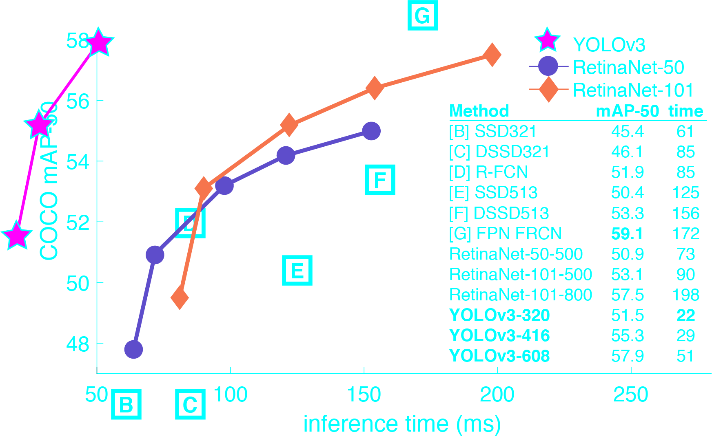
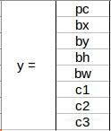

# YOLO Và Các Thuật toán Object Detection

<!--more-->

# Object Detection And YOLO  
## 1. Giới thiệu về Object Detection và thuật toán  
### A. Object Detection là gì?  
**Objetc Detection** ( Phát hiện đối tượng) là một công nghệ máy tính liên quan đến lĩnh vực Computer Vision (thị giác máy tính) và Image Processing (Xử lý ảnh) nhằm phát hiện các đối tượng trong ảnh hoặc video kỹ thuật số (chẳng hạn như con người, đồ vật, động vật, thực vật, tòa nhà...). Object Detection có rất nhiều ứng dụng trong nhiều lĩnh vực Computer Vision như nhận diện khuôn mặt, Face ID của apple, hệ thống giám sát hàng loạt của trung quốc, ...

Dưới đây là cái nhìn tổng quát, để cho chúng ta có thể dễ dàng thấy được Object Detection đang nằm ở đâu trong những bài toán của Computer Vision.

***Image Classification:***  nhằm mục đích gán hình ảnh cho một trong số các danh mục khác nhau (ví dụ: ô tô, chó, mèo, người, v.v.), về cơ bản nó sẽ là câu trả lời của câu hỏi "Cái gì trong hình này?"_. Một hình ảnh chỉ có một danh mục được gán cho nó.

***Object Localization:*** sau đó chúng ta định vị đối tượng của mình trong hình ảnh, vì vậy câu hỏi của chúng ta lúc này chuyển thành _"Nó là gì và nó ở đâu?"_ .

***Object Detection:*** cung cấp các công cụ để thực hiện việc tìm kiếm tất cả các đối tượng trong một hình ảnh và vẽ cái gọi là **hộp giới hạn** ***(Bounding Boxes)*** xung quanh chúng. Cũng có một số tình huống mà chúng ta muốn tìm ranh giới chính xác của các đối tượng của mình trong quá trình được gọi là **phân đoạn cá thể** **(***instance segmentation***)**.

### B. Các thuật toán của Object Detection  
**Thuật toán Object Detection:** Có 3 mô hình thuật toán chính về object detection mà chúng ta sẽ thường xuyên gặp phải:  
  
- R-CNN và các biến thể: bao gồm R-CNN gốc, Fast R-CNN và Faster R-CNN  
- Single Shot Detector (SSD)  
- You only look one (YOLO)  
  
**R-CNNs** là một trong những mô hình thuật toán về phát hiện đối tượng đầu tiên dựa trên deep learning và là một hình mẫu về việc nhận diện qua 2 giai đoạn:  
  
- Trong ấn phẩm đầu tiên của R-CNN,[ # Rich feature hierarchies for accurate object detection and semantic segmentation](https://arxiv.org/abs/1311.2524) (tạm dịch: Hệ thống phân cấp tính năng các điểm đặc trưng để nhận đối tượng và phân đoạn ngữ nghĩa), (2013) Girshick et al. đã đề xuất một giải thuật tìm kiếm có chọn lọc nhằm tạo và trích xuất các vùng có khả năng chứa vật thể được bao bọc bởi các hộp giới hạn (gọi là boundingbox).  
- Những vùng này sau đó được chuyển vào CNN để phân loại, cuối cùng cho chúng ta một trong những công cụ phát hiện đối tượng đầu tiên dựa trên học sâu (deep learning) .  
  
Vấn đề của phương pháp R-CNN bản gốc này là nó rất chậm, và nó chưa hoàn chỉnh.  
  
**Fast R-CNN:** Girshick và các cộng sự xuất bản bài báo thứ 2 vào năm 2015, có tựa đề [Fast R-CNN](https://arxiv.org/abs/1504.08083) . Thuật toán Fast R-CNN đã thực hiện những cải tiến đáng kể đối với R-CNN ban đầu, cụ thể là tăng độ chính xác và giảm thời gian thực hiện, tuy nhiên nó vẫn cần một tập hợp vùng đề xuất cho mỗi ảnh.

**Faster R-CNN:** Cũng vào năm 2015, Grishick và các cộng sự tiếp tục công bố bài báo thứ 3 [Faster R-CNN: Towards Real-Time Object Detection with Region Proposal Networks](https://arxiv.org/abs/1506.01497) (tạm dịch: R-CNN nhanh hơn: Hướng tới phát hiện đối tượng theo thời gian thực với mạng đề xuất khu vực). Đến lúc này, R-CNNs mới trở thành công cụ phát hiện đối tượng học sâu end-to-end thực sự bằng cách loại bỏ yêu cầu tìm kiếm có chọn lọc và thay vào đó dựa vào Mạng đề xuất khu vực (RPN). Đầu ra của RPN sau đó được chuyển vào thành phần R-CNN để phân loại và dán nhãn cuối cùng.
R-CNNs có xu hướng rất chính xác, nhưng vấn đề lớn nhất với họ mạng R-CNN là tốc độ của chúng - chúng cực kỳ chậm, chỉ thu được 5 FPS trên GPU.

**SSD và YOLO:** Để tăng tốc độ cho Object Detection, hai mô hình thuật toán mới đã ra đời là SSD và YOLO, cả hai đều sử dụng chung một chiến lược, đó là: phát hiện đối tượng trong 1 giai đoạn. Nói chung, thì cả YOLO và SSD có độ chính xác kém hơn nhưng nhanh hơn đáng kể.

Trong những dự án thực tế, tốc độ đóng vai trò vô cùng quan trọng, nên SSD và YOLO dần chiếm ưu thế khi khoảng cách về độ chính xác giữa chúng và mô hình nhận diện hai giai đoạn của họ mạng R-CNN ngày càng được thu hẹp. 

Ở bài viết này, mình sẽ tập trung nói và viết về YOLO và để dành SSD cho bài viết khác, bởi theo như mình thấy hiện tại thì YOLO khá được ưa chuộng, và nó liên tục có những bản cập nhật mới từ khi ra đời vào năm 2015, hiện tại thì YOLOv5 đang làm mưa làm gió trên các diễn đàn về AI, ML, DL,... nhờ những đột phá mới, đặc biệt là tính dễ sử dụng.

So với người anh em YOLO, SSD chỉ có 2 bản là SSD 300 và SSD 500, và chưa có bản update nào kể từ khi ra mắt. Thế nhưng SSD vẫn có những ưu điểm riêng và độ hiệu quả cũng vô cùng ấn tượng.

Theo lẽ thường thì chúng ta sẽ phân tích ưu nhược điểm của YOLO sau khi nghiên cứu mô hình và cấu trúc mạng mà nó sử dụng, nhưng cá nhân mình thường nhìn vào kết quả và cách sử dụng trước sau đó mới tiến hành nghiên cứu chi tiết mô hình và cấu trúc của nó, điều này giúp mình rút ngắn kha khá thời gian khi làm một project. Việc học, làm như thế này cũng cho mình một cái nhìn tổng quát về những thứ mình đang làm, trước khi tìm hiểu sâu hơn vào một ví dụ cụ thể. 

Vậy ưu và nhược điểm của YOLO là gì và khi nào thì nên sử dụng nó?
## 2. YOLO - You Only Look Once
Như đã nói ở trên YOLO là mô hình nhận diện một giai đoạn, nghĩa là coi việc phát hiện đối tượng như một bài toán hồi quy, lấy một hình ảnh đầu vào nhất định và đồng thời học tọa độ hộp giới hạn cùng xác suất nhãn lớp tương ứng.
### A. Ưu điểm:  
Những ưu điểm chính của YOLO:  
1. Nhanh chóng và chính xác  
2. Gọn nhẹ  
3. Mã nguồn mở (Open source)  
4. Bạn có thể dễ dàng đánh đổi giữa tốc độ và độ chính xác chỉ bằng cách thay đổi kích thước của mô hình, không cần đào tạo lại!  
  
### B. Nhược điểm:  
Những nhược điểm chính của YOLO:  
1. Nhận diện chưa tốt nếu vật thể nhỏ đến rất nhỏ  
2. YOLO khó nhận diện những object nằm gần nhau  
  
Lý do của những hạn chế này là do chính thuật toán của YOLO mang lại:  
  
- Bộ phát hiện đối tượng YOLO chia hình ảnh đầu vào thành một mạng lưới SxS trong đó mỗi ô trong lưới chỉ dự đoán một đối tượng duy nhất.  
- Nếu tồn tại nhiều đối tượng nhỏ trong một ô thì YOLO sẽ không thể phát hiện chúng, cuối cùng dẫn đến việc phát hiện đối tượng bị bỏ sót.  
  
***Do đó, nếu bạn biết tập dữ liệu của mình bao gồm nhiều đối tượng nhỏ được nhóm gần nhau thì bạn không nên sử dụng bộ dò đối tượng YOLO.***  
  
Về các đối tượng nhỏ, Faster R-CNN có xu hướng hoạt động tốt nhất; tuy nhiên, nó cũng là chậm nhất.  
  
SSD cũng có thể được sử dụng ở đây, vấn đề SSD cũng có thể gặp khó khăn với các vật thể nhỏ hơn (nhưng không nhiều như YOLO).  
  
SSD cũng thường đem lại sự cân bằng tốt về tốc độ và độ chính xác.  
  
Dưới đây là một số kinh nghiệm khi chọn mô hình nhận diện đối tượng cho dự án của bạn:  
  
- Nếu bạn cần phát hiện các vật thể nhỏ và tốc độ không phải là vấn đề đáng lo ngại, bạn nên dùng Faster R-CNN.  
- Nếu tốc độ là điều tối quan trọng, bạn nên sử dụng YOLO.  
- Nếu bạn cần sự cân bằng hoàn hảo giữa Faster R-CNN và YOLO hãy chọn SSD.

Dưới đây là một số hình ảnh so sánh giữa YOLO và các mô hình mạng khác với bộ dữ liệu MS COCO:

 
 mAP-50, AP: Đơn vị đo độ chính xác
 ms: mili giây

Và bây giờ chúng ta hãy cùng tìm hiểu xem YOLO hoạt động như thế nào?

### C. Cách Thức Hoạt Động Của YOLO Như Thế Nào?

 
 1. Đầu tiên YOLO chụp ảnh đầu vào:
 
 	

 
 2. Sau đó, chia hình ảnh đầu vào thành các ảnh nhỏ hơn dạng lưới (giả sử là lưới 3 X 3):
 	
 	

 
 3. Phân loại và Localization hình ảnh được áp dụng trên mỗi ô lưới. Sau đó, YOLO dự đoán các hộp giới hạn và xác suất lớp tương ứng của chúng cho các đối tượng (tất nhiên là nếu có).

Khá đơn giản, phải không :D? Hãy chia nhỏ từng bước để hiểu chi tiết hơn về những gì chúng ta vừa học.
Chúng ta cần chuyển dữ liệu được gắn nhãn vào mô hình để huấn luyện nó. Giả sử chúng ta đã chia hình ảnh thành một lưới kích thước 3 X 3 và có tổng cộng 3 lớp mà chúng ta muốn các đối tượng được phân loại. Giả sử các nhãn học lần lượt là Người đi bộ, Xe ô tô và Xe máy. Vì vậy, đối với mỗi ô lưới, nhãn *y* sẽ là một vectơ tám chiều:

Chú thích:

 - pc xác định xem một đối tượng có trong ô lưới hay không (nó là xác suất)
 - bx , by , bh , bw chỉ định hộp giới hạn (bounding box) nếu có một đối tượng
 - c1 , c2 , c3 đại diện cho các lớp. Vì vậy, nếu đối tượng là một chiếc ô tô, c2 sẽ là 1 và c1 & c3 sẽ là 0, v.v...

Giả sử ta chọn ô lưới đầu tiên từ ví dụ trên:

Vì không có đối tượng nào trong ô lưới này, pc sẽ bằng 0 và nhãn y cho ô lưới này sẽ là:

'?' ở đây có nghĩa là bx, by, bh, bw, c1 , c2 và c3 chứa những gì không quan trọng vì không có đối tượng nào trong ô lưới. Hãy lấy một ô lưới khác trong đó chúng ta có một chiếc ô tô (c2 = 1):

Trước khi chúng ta viết nhãn y cho ô lưới này, điều quan trọng trước tiên là phải hiểu cách YOLO quyết định liệu thực sự có một đối tượng trong ô lưới hay không. Trong hình trên, có hai đối tượng (hai ô tô), vì vậy YOLO sẽ lấy điểm trung tâm của hai đối tượng này và các đối tượng này sẽ được gán vào lưới chứa điểm trung tâm của chúng. Nhãn y cho ô lưới chứa ô tô bên trái sẽ là:

Vì có một đối tượng trong ô lưới này, pc sẽ bằng 1. bx , by , bh , bw sẽ được tính liên quan đến ô lưới cụ thể mà chúng ta đang xử lý. Vì ô tô là hạng thứ hai nên c2 = 1 và c1 và c3 = 0. Vì vậy, với mỗi ô lưới trong số 9 ô lưới, chúng ta sẽ có một vectơ đầu ra tám chiều. Đầu ra này sẽ có hình dạng 3 X 3 X 8.
Vì vậy, bây giờ chúng ta có một hình ảnh đầu vào và đó là vector mục tiêu tương ứng. Sử dụng ví dụ trên (hình ảnh đầu vào 100 X 100 X 3, đầu ra 3 X 3 X 8), mô hình của chúng ta sẽ được đào tạo như sau:

(!): *Cho những bạn chưa biết thì giai đoạn nằm giữa từ Input đến Ouput, chính là mạng thần kinh tích chập CNN (Convolutional neural network), nó mô phỏng lại mạng neuron thần kinh não người.* 

Để cho mọi thứ trở nên đơn giản hơn, mình đã giải thích ví dụ trên bằng cách sử dụng lưới 3 X 3, nhưng hầu hết trong các tình huống thực tế, chúng ta sẽ phải sử dụng các lưới lớn hơn (có lẽ là 19 X 19).

Ngay cả khi một đối tượng (object) nó trải dài ra nhiều hơn một ô lưới thì nó vẫn sẽ chỉ được gán cho một ô lưới duy nhất mà điểm giữa của nó nằm ở đó. Chúng ta có thể giảm khả năng nhiều đối tượng xuất hiện trong cùng một ô lưới bằng cách tăng số lượng ô nhiều hơn (ví dụ: 19 X 19).

Mình rất hi vọng, đọc đến đây thì những bạn chưa từng tiếp cận AI, ML... cũng có thể hiểu đại khái 80-90 %.
Cùng nhìn lại một chút, xem còn những gì chưa giải đáp không nhỉ? dài thực sự :D.
À cái đống bx, by, bh, bw chỉ định hộp giới hạn, hộp giới hạn hay bounding box - cái khung màu đỏ mà các bạn thấy, cái đống hộp xanh, đỏ, tím, vàng này thú vị lắm, cùng giải mã chúng thôi!
#### C.1 Giải Mã Bounding Box
Như mình đã đề cập trước đó bx, by, bh và bw có mối liên hệ tới ô lưới mà chúng ta đang xử lý cụ thể là chỉ định bounding box. Cùng tìm hiểu nó qua một ví dụ. Hãy xem xét ô lưới chứa ô tô bên phải trong ảnh:

Nhãn y cho ô lưới này sẽ là:

pc = 1 vì có một đối tượng trong lưới này và vì nó là một chiếc ô tô nên c2 = 1. Bây giờ, chúng ta hãy xem cách quyết định bx , by , bh và bw . Trong YOLO, tọa độ được gán cho tất cả các ô lưới là:

bx , by là tọa độ x và y của trung tâm vật thể đối với ô lưới này. Trong trường hợp này, nó sẽ là (khoảng) bx = 0,4 và by = 0,3:

bh là tỷ số giữa chiều cao của ô giới hạn (ô màu đỏ trong ví dụ trên) với chiều cao của ô lưới tương ứng, trong trường hợp của chúng ta là khoảng 0,9. Vậy, bh = 0,9. bw là tỷ số giữa chiều rộng của ô giới hạn với chiều rộng của ô lưới. Vì vậy, bw = 0,5 (xấp xỉ). Nhãn y cho lưới này sẽ là:

Lưu ý ở đây rằng bx và by sẽ luôn nằm trong khoảng từ 0 đến 1 vì điểm giữa sẽ luôn nằm trong ô lưới. Trong khi bh và bw có thể nhiều hơn 1 trong trường hợp kích thước của hộp giới hạn lớn hơn kích thước của ô lưới.
Trong phần tiếp theo, chúng ta sẽ xem xét những ý tưởng để cải thiện hiệu suất của thuật toán này.
#### C.2 Intersection over Union (IoU) and Non-Max Suppression
Có thể bạn sẽ thắc mắc: "Cái tiêu đề gì khó hiểu quá :( ?" , mình cũng chẳng biết dịch sang tiếng việt sao cho chuẩn, thôi thì... Lại thêm một ví dụ nữa cho dễ hiểu hơn, đầu tiên là về **IoU** cùng xem xét hình ảnh dưới đây nhé :D:
**IoU:**

Mình sẽ giải thích một chút, ở đây, hộp màu đỏ là hộp giới hạn thực tế (chỉ định bounding box chạy bằng cơm) còn hộp màu xanh là hộp giới hạn dự đoán. Làm thế nào chúng ta có thể quyết định liệu đó có phải là một dự đoán tốt hay không? IoU hay Intersection over Union sẽ tính toán diện tích của phần giao nhau trên liên kết của hai hộp này. Khu vực đó sẽ là:

IoU = Diện tích intersection / Diện tích union, tức là:

IoU = Diện tích ô màu vàng / Diện tích ô màu xanh lá cây.
Nếu IoU lớn hơn 0,5, chúng ta có thể cho rằng đây là một dự đoán đủ tốt. Nhưng đây là một ngưỡng tuỳ ý, bạn có thể chọn một ngưỡng khác cho phù hợp với bài toán của bạn.
Có một kỹ thuật nữa có thể cải thiện đáng kể đầu ra của YOLO đó là Non-Max Suppression.

Một trong những vấn đề phổ biến nhất với các thuật toán Object Detection là thay vì chỉ phát hiện đối tượng một lần, thì chúng có thể phát hiện đối tượng nhiều lần. Hãy xem hình ảnh dưới đây:

**Non-Max Suppression:** Đây là một thuật toán hay và khá quan trọng, chính bản thân mình cũng từng gặp vấn đề này trong một dự án liên quan đến nhận diện lỗi trong bảng mạch điện tử, kỹ thuật này đã giúp mình rất nhiều. Hãy cùng xem cách nó hoạt động như thế nào (mình sẽ chỉ nói sơ qua để tránh lệch trọng tâm bài viết).

1. Hãy tưởng tượng, mô hình YOLO của bạn phát hiện được rất nhiều box, hay còn gọi là proposal box, ta sẽ có một tập hợp proposal box. lấy ra một proposal box có pc lớn nhất (bạn còn nhớ pc là gì chứ? nếu không nhớ mình sẽ nhắc lại, pc là xác suất để một object xuất hiện trong proposal box). Trong hình dưới 0,9 là xác suất cao nhất, vì vậy proposal box có pc = 0,9 sẽ được chọn đầu tiên:

2. Bây giờ chúng ta sẽ lấy nó so sánh với các proposal box còn lại, chọn một ngưỡng N = 0,5, tính tỉ lệ IoU của proposal box ta đã chọn với proposal box còn lại, mình lấy ví dụ là hộp có pc =0,6. giả sử ta tính được IoU = 0,6. lớn hơn ngưỡng mà chúng ta đã chọn, ta có thể loại bỏ nó khỏi tập hợp proposal box.

3. Lặp đi lặp lại bước 2 và chúng ta có bounding box duy nhất.

Có một phương pháp khác mà chúng ta có thể sử dụng để cải thiện hiệu suất của thuật toán YOLO - hãy cùng khám phá nhé :D.
#### C.3 Anchor Box
Chúng ta đã thấy rằng mỗi ô lưới chỉ có thể xác định một đối tượng. Nhưng nếu có nhiều đối tượng trong một ô lưới duy nhất thì sao? Điều đó thường xảy ra trong thực tế. Và điều cho ra đời một khái niệm Anchor. Hãy xem xét hình ảnh sau đây, được chia thành lưới 3 X 3:

Hãy nhớ cách chúng ta đã gán một đối tượng vào lưới? Chúng ta lấy điểm giữa của đối tượng và dựa trên vị trí của nó, gán đối tượng vào ô lưới tương ứng. Trong ví dụ trên, điểm giữa của cả hai đối tượng nằm trong cùng một ô lưới. Xem hình ảnh minh hoạ:

Chúng ta sẽ chỉ nhận được một trong hai hộp, cho ô tô hoặc cho người. Nhưng nếu chúng ta sử dụng anchor box, chúng ta có thể xuất cả hai hộp! làm thế nào để chúng ta làm được? Đầu tiên, chúng ta xác định trước hai hình dạng khác nhau được gọi là anchor box ( anchor box shape). Bây giờ, đối với mỗi ô lưới, thay vì có một đầu ra, chúng ta sẽ có hai đầu ra. Chúng ta luôn có thể tăng số lượng hộp neo. Mình đã lấy hai ở đây để có một ví dụ dễ hiểu:

Nhãn y sẽ là:

8 hàng đầu tiên thuộc anchor box 1 và 8 hàng còn lại thuộc anchor box 2. Đầu ra trong trường hợp này, thay vì 3 X 3 X 8 (sử dụng lưới 3 X 3 và 3 lớp), sẽ là 3 X 3 X 16 (vì chúng ta đang sử dụng 2 Anchor).

Bài viết này khá là dài rồi, nên có lẽ mình sẽ tạm dừng tại đây. Ở những bài sau có lẽ mình sẽ viết hướng dẫn về cách áp dụng YOLO vào những dự án thực tế. Mình sẽ làm một project nhỏ để demo. 

Hi vọng bạn thích bài viết này.

Tài Liệu Tham Khảo:
1. [https://www.pyimagesearch.com/yolo-object-detection-with-opencv](https://www.pyimagesearch.com/2018/11/12/yolo-object-detection-with-opencv/?fbclid=IwAR2WdzrWvfgY4E6JMekrLohBJRGE11sgEB1plfWPqmUc5torIQbmc7KDVIc)
2. https://www.coursera.org/lecture/convolutional-neural-networks/anchor-boxes-yNwO0
3. https://www.coursera.org/lecture/convolutional-neural-networks/non-max-suppression-dvrjH
4. https://en.wikipedia.org/wiki/Object_detection
