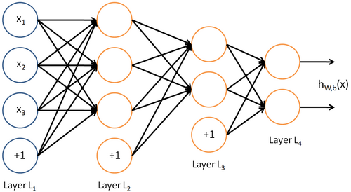
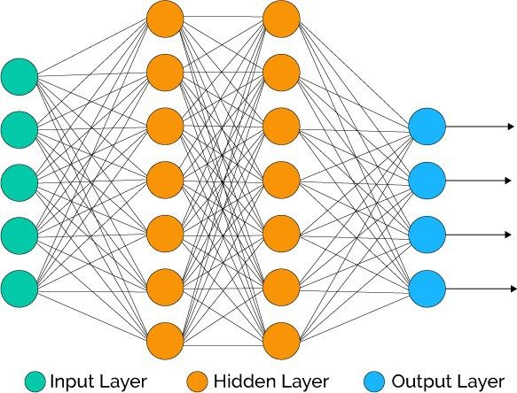

# Tổng Quan Về Neural Network

<!--more-->

# Tổng Quan Artificial Neural Network
## 1. Neural Network là gì? Sự tương quan giữa Neural Network và não bộ của con người.
Nguồn gốc của Neural Network là một thuật toán bắt chước não bộ, xuất phát từ việc nếu chúng ta muốn xây dựng các hệ thống learning. Và một câu hỏi được đặt ra là: "tại sao chúng ta lại không bắt chước bộ máy học tập tuyệt vời nhất là não bộ?".

Neural Networks đã được sử dụng rộng rãi từ những năm 1980 đến 1990, và vì nhiều lý do, nó ít phổ biến dần vào cuối những năm 90. Nhưng ngày này, neural networks đã có sự hồi sinh trở lại. Một trong những lý do cho sự hồi sinh này đó là neural networks là một thuật toán cần phải xử lý tính toán rất cồng kềnh, và nó chỉ có thể chạy được với những máy tính đủ nhanh như ngày nay và cũng bởi vì một số lý do kỹ thuật khác mà mình sẽ không đề cập ở đây. Đến nay, Neural networks đã trở thành một kỹ thuật tiên tiến cho nhiều ứng dụng.

Bạn hãy thử nghĩ về việc bắt chước não bộ, não bộ của con người làm được rất nhiều điều tuyệt vời như: học cách để nhìn hình ảnh, học để nghe, học để xử lý cảm nhận tiếp xúc qua da, học để làm toán,… và rất nhiều việc tuyệt vời khác nữa. Rõ ràng nếu bạn muốn bắt chước não bộ thì bạn phải viết rất nhiều phần khác nhau của phần mềm để bắt chước các chức năng tuyệt vời đó. Nhưng liệu có phải rằng bộ não thực hiện các chức năng này giống với hàng ngàn chương trình khác nhau hay không? Hay thay vào đó, cách mà bộ não thực hiện chỉ giống như một thuật toán học tập duy nhất mà thôi? Và nếu có thì nó là gì và trông như thế nào? Nếu áp dụng và triển khai được nó trên máy tính, đó có thể sẽ là một bước tiến lớn cho việc thực hiện hoá trí tuệ nhân tạo - AI.
## 2. Biểu diễn mô hình Neural Network
Neural Networks được xây dựng bằng cách mô phỏng các neuron hoặc mạng lưới neuron trong não bộ (neuron còn được gọi là tế bào não). Do đó, để dễ dàng hình dung sự tương quan này, chúng ta nên tìm hiểu sơ qua về neuron trong não bộ:

Neuron cấu tạo gồm 3 thành phần chính:

 - 1 thân chứa nhân ( Cell body hoặc Nucleus)
 - 1 sợi trục dẫn truyền ly tâm (Axon)
 - Các sợi nhánh (Dendrite)

**Sợi nhánh (Dendrite):** nơi tiếp nhận xung động thần kinh để truyền đến neuron, bạn có thể xem nó như là input đầu vào dữ liệu.
**Thân chứa nhân(Cell Body):** Đây là nơi tiếp nhận các xung động thần kinh, nó lấy các giá trị đầu vào thông qua sợi nhánh và thực hiện tính toán, sau đó gửi giá trị đầu ra thông qua sợi trục đến các neuron khác trong não bộ.

**Sợi trục (axon):** Chính là nơi dẫn truyền những thông tin đầu ra hay output.
### 2.1 Mô hình Neural: Logistic Unit

Trong một Neural Network mà ta triển khai trên máy tính, chúng ta thường sẽ sử dụng một mô hình rất đơn giản của neural, hãy xem hình dưới đây:

Chúng ta sẽ mô hình hoá một neuron như là một đơn vị logistic. Vòng tròn lớn màu vàng tượng trưng như là thân của một neuron. *x0, x1, x2, x3* chính là những giá trị input được đưa vào thân neuron bằng sợi nhánh, neuron sẽ thực hiện tính toán và cho ra một vài giá trị đầu ra thông qua sợi trục. *h0(X)* là hàm tính toán biểu diễn các giá trị output.

Thỉnh thoảng ta sẽ gọi một neuron nhân tạo là hàm kích hoạt sigmoid (sigmoid activation) hoặc hàm kích hoặt logistic (logistic activation). Nó cũng còn một tên gọi khác là **weights (w) .**

Ở trên là mô hình biểu diễn một neuron. vậy một mạng lưới neuron sẽ được biểu diễn như thế nào?
### 2.2 Neural Network

Một Neural Network là một nhóm các neuron kết nối với nhau. Cùng xem ảnh dưới đây.

Cụ thể ở đây, chúng ta có các giá trị đầu vào : *x0, x1, x2, x3* (*x0* có giá trị luôn bằng 1, ta có thể bỏ qua hoặc không tuỳ những ví dụ khác nhau) chúng lần lượt đi qua các neuron (hình tròn vàng), các neuron thực hiện tính toán và cho ra các giá trị output: *w1,w2,w3..wi* , các giá trị này tiếp tục đi qua các neuron tiếp theo, ta có thể dễ dàng thấy rằng, output của các neuron trước chính là input của các neuron sau, cho đến các neuron cuối sẽ cho ra một giá trị *weight* cuối cùng.

Hãy cùng nhìn qua một số thuật ngữ sẽ được sử dụng sau này, Layer đầu tiên-_Layer L1_ được gọi là Input Layer bởi vì đây là nơi đưa vào các feature của chúng ta, *x1, x2, x3*. Layer cuối cùng-_Layer L4_ được gọi là Output layer vì nó là layer cho ra giá trị cuối cùng đã được tìm ra qua hàng loạt xử lý tính toán. _Layer L2_ và _Layer L3, những Layer nằm ở trung gian được gọi là hidden layer.

Minh hoạ:

